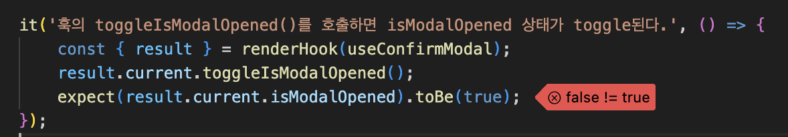
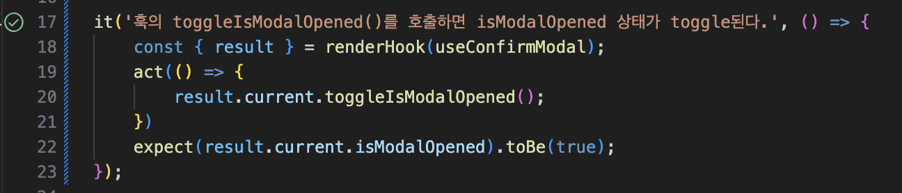

# 섹션 4 단위 테스트 작성하기

> # 단위 테스트 대상 선정하기

- UI만 그리는 역할을 수행하는 컴포넌트는 스토리북으로 컴포넌트의 스타일이나 레이아웃이 깨지지않는지 확인하는 것이 더 중요하다.
- jsDOM에서는 실제로 돔을 페인팅 하는 것이 아니기 때문에 스타일이나 레이아웃이 제대로 나오는 지 확인하기 어렵다.
- 로직이 있어도 복잡하지 않다면 통합 테스트를 통해 검증하는 것이 효울적일 수 있다.
- 컴포넌트 외에도 **리액트 훅과 유틸함수**가 단위 테스트 대상으로 적합하다.

> # 모듈 모킹

- 단위 테스트에서 외부 모듈에 대한 검증은 완전히 분리하고 모듈의 특정 기능을 제대로 호출하는지만 검증한다.
- 이 때 모듈의 특정 기능을 모킹으로 검증할 수 있다.
- 모킹은 외부 모듈과 의존성을 제외한 필요한 부분만 검증이 가능하다.
- 실제 모듈과 동일하게 구현하게되면 큰 비용이 든다.
- 모킹의 남용은 신뢰성을 낮춘다.

### EmptyNotice TestCode

```js
/* eslint-disable prettier/prettier */
import { screen } from "@testing-library/react";
import React from "react";

import EmptyNotice from "@/pages/cart/components/EmptyNotice";
import render from "@/utils/test/render";

// 실제 모듈을 모킹한 모듈로 테스트한다.
// useNavigate 훅으로 반환받은 navigate 함수가 올바르게 호출되었는가 -> 스파이 함수

const navigateFn = vi.fn();

vi.mock("react-route-dom", async () => {
  const origin = await vi.importActual("react-route-dom");
  return { ...origin, useNavigate: () => navigateFn };
});

it('"홈으로 가기" 링크를 클릭할경우 "/"경로로 navigate함수가 호출된다', async () => {
  const { user } = await render(<EmptyNotice />);
  await user.click(screen.getByText("홈으로 가기"));
  expect(navigateFn).toHaveBeenNthCalledWith(1, "/");
});
```

### ErrorPage TestCode

```js
/* eslint-disable prettier/prettier */
import { screen } from "@testing-library/react";
import React from "react";

import ErrorPage from "@/pages/error/components/ErrorPage";
import render from "@/utils/test/render";

const navigateFn = vi.fn();

vi.mock("react-route-dom", async () => {
  const origin = await vi.importActual("react-route-dom");
  return { ...origin, useNavigate: () => navigateFn };
});

it('"뒤로 이동" 버튼 클릭시 뒤로 이동하는 navigate(-1) 함수가 호출된다', async () => {
  const { user } = await render(<ErrorPage />);
  const button = await screen.getByRole("button", { name: "뒤로 이동" });
  await user.click(button);
  expect(navigateFn).toHaveBeenNthCalledWith(1, -1);
});
```

### NotFoundPage TestCode

```js
/* eslint-disable prettier/prettier */
import { screen } from "@testing-library/react";
import React from "react";

import NotFoundPage from "@/pages/error/components/NotFoundPage";
import render from "@/utils/test/render";

const navigateFn = vi.fn();

vi.mock("react-route-dom", async () => {
  const origin = await vi.importActual("react-route-dom");
  return { ...origin, useNavigate: () => navigateFn };
});

it('Home으로 이동 버튼 클릭시 홈 경로로 이동하는 navigate가 실행된다"', async () => {
  const { user } = await render(<NotFoundPage />);
  await user.click(screen.getByText("Home으로 이동"));
  expect(navigateFn).toHaveBeenNthCalledWith(1, "/", { replace: true });
});
```

- 특정 테스트의 모킹 작업이 다른 테스트의 영향을 줄 수 있기 때문에 모킹 초기화가 필요하다.
- 각 테스트의 독립성과 안정성을 보장하기 위해 teardown에서 모킹을 초기화 해줘야한다.
- vi.clearAllMocks - 모킹 히스토리 초기화(각 테스트 종료 뒤, afterEach)
- vi.restAllMocks - 모킹 모듈에 대한 모든 구현을 초기화 (테스트가 끝난 뒤, afterAll)

> # 리액트 훅 테스트

- 리액트 훅 테스트를 위해 리액트 테스트 라이브러리에서 renderHook 함수를 지원한다.
- result - 훅을 호출하여 얻은 결과값을 반환한다, result.current 값의 참조를 통해 최신 상태를 추적할 수 있다.
- rerender - 훅을 원하는 인자와 함께 새로 호출하여 상태를 갱신한다.
- act 함수
  - 컴포넌트를 렌더링한 뒤 업데이트하는 코드의 검증을 위해 사용한다.
  - 테스트 환경에서 컴포넌트 렌더링 결과를 jsdom에 반영하기 위해서는 act 함수를 반드시 호출해야한다.
  - 리액트 테스트 라이브러리는 내부적으로 act 함수를 호출하여 반영한다.
    
    

> # 타이머 테스트

- 테스트코드는 비동기 타이머와는 무관하게 실행된다. -> 비동기 함수가 실행되기 전에 단언이 실행된다.
- 타이머 모킹 또한 초기화가 필요하다.

```js
describe("debounce", () => {
  // 타이머 조작
  beforeEach(() => {
    vi.useFakeTimers();
  });

  // 타이머 초기화
  afterEach(() => {
    vi.useRealTimers();
  });

  it("특정 시간이 지난 후 함수가 호출된다.", () => {
    const spy = vi.fn();
    const debouncedFn = debounce(spy, 300);
    debouncedFn();
    vi.advanceTimersByTime(300);
    expect(spy).toHaveBeenCalled();
  });

  it("연이어 호출해도 마지막 호출 기준으로 지정된 타이머 시간이 지난 경우에만 함수가 호출된다.", () => {
    const spy = vi.fn();
    const debouncedFn = debounce(spy, 300);
    debouncedFn();
    vi.advanceTimersByTime(200);
    debouncedFn();
    vi.advanceTimersByTime(100);
    debouncedFn();
    vi.advanceTimersByTime(200);
    debouncedFn();
    vi.advanceTimersByTime(300);
    expect(spy).toHaveBeenCalledTimes(1);
  });
});
```

> # userEvent를 사용한 사용자 상호작용 테스트

- fireEvent : DOM event를 시뮬레이션하기 위헤 제공하며 내장되어 있기 때문에 별도의 설치 없이 사용이 가능하다.
- fireEvent와 userEvnet가 나뉘어져있는 까닭
  - fireEvent의 동작은 단순하게 해당 이벤트만 디스패치한다. 연쇄적으로 발생하는 이벤트에 대해서 고려되지 않는다.
  - userEvnet는 클릭으로서 동작되는 포커스, 마우스업, 마우스다운, 등 연쇄적으로 발생하는 이벤트에 대해 고려한다.
  - 따라서 테스트의 신뢰성이 향상되는 userEvnet의 사용이 권장된다.
- 대부분의 사례는 userEvnet로 가능하며, userEvnet에서 지원되지 않는 부분이 있을 때 fireEvent의 사용을 고려한다.

> # 단위 테스트의 한계

- 공통 컴포넌트, 리액트 훅, 공통 유틸과 같은 다른 모듈에 대해 의존성이 거의 없을 때 유용하다.
- 해당 모듈만으로 작지만 자체적으로 독립적인 역할을 수행하는 것들에 대해 테스트할 때 유용하다.
- 효율적으로 모듈의 핵심 기능을 테스트할 수 있다.
- **단점**

  - 여러 모듈이 조합되었을 때 발생하는 이슈는 찾을 수 없다.
  - 앱의 전반적인 기능이 비즈니스 요구사항에 맞게 동작하는지 알 수 없다.
  - 즉 단위 테스트에서 검증하지 못하는 부분은 통합,E2E,시각적 테스트 등 다양한 테스트로 보강해야한다.

- 통합테스트
  - 여러 모듈이 조합되었을 때 비즈니스 로직을 검증한다.
  - 여러 컴포넌트들의 상호작용을 한 번에 검증할 수 있다.
